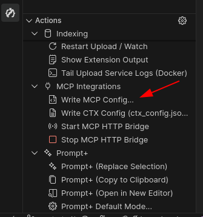

# Easy K3s Install Guide

This guide explains how to quickly deploy Context Engine on a single-node VPS using K3s (lightweight Kubernetes) and connect it to your local VS Code.

## Prerequisites

- Linux VPS with at least 8GB RAM and 20GB disk space
- Docker installed (for building images)
- Root or sudo access

## 1. Quick Install (Runs Locally)

Open your local pc (cmd/terminal) and run these commands:

```bash
# Clone the repository
git clone https://github.com/m1rl0k/Context-Engine.git
cd Context-Engine/deploy/k3s-overlay

# Run the easy install script
chmod +x easy_install.sh build_k3s_images.sh
sudo ./easy_install.sh
```

**What this script does:**

* Installs **K3s** (Lightweight Kubernetes) if not already installed
* Builds and imports all Docker images into K3s containerd
* Deploys all services with single-node optimizations (RWO volumes, local-path storage)
* Enables **Remote Upload** feature for VS Code integration
* Outputs your connection URL

## 2. Connect VS Code

Once the script finishes, it will show a URL like `http://1.2.3.4:30810`.

1. Open **VS Code** locally.
2. Install the **Context Engine** extension.
3. Go to **Settings** (`Ctrl+,` or `Cmd+,`) and search for `Context Engine`.

**Required Settings (General tab):**
- **Endpoint**: `http://YOUR_SERVER_IP:30810` (replace with your actual server IP)
- **Scaffold Config**: `true` (creating `ctx_config.json`, `.env`, `.mcp.json` globally)

**Required Settings (MCP Server tab):**
- **Indexer URL**: `http://YOUR_SERVER_IP:30806/mcp` (for MCP indexer)
- **Memory URL**: `http://YOUR_SERVER_IP:30804/mcp` (for MCP memory)

**Auto-Write MCP:**
- **MCP Integrations** → **Auto-write on Startup**: `false` (disable automatic mcp add for indexer and memory, you can just run it once manually for each IDE (cursor/augment/windsurf/antigravity) from write mcp command)


**Optional Settings:**
- **Run On Startup**: Enable to auto-index when VS Code opens
- **Python Path**: Set to `python3` or your Python executable

**Complete K3s Port Reference:**

| Service | Port | VSCode Setting | URL Format |
|---------|------|----------------|------------|
| Upload Service | `30810` | Endpoint | `http://IP:30810` |
| MCP Memory HTTP | `30804` | Memory URL | `http://IP:30804/mcp` |
| MCP Indexer HTTP | `30806` | Indexer URL | `http://IP:30806/mcp` |
| LlamaCPP Decoder | `30808` | Decoder URL | `http://IP:30808` |
| MCP Memory SSE | `30800` | (for SSE mode) | `http://IP:30800/sse` |
| MCP Indexer SSE | `30802` | (for SSE mode) | `http://IP:30802/sse` |
| Qdrant HTTP | `30333` | (internal) | `http://IP:30333` |
| Qdrant gRPC | `30334` | (internal) | `IP:30334` |

**Full VSCode Extension Settings for K3s:**

| Tab | Setting | Value |
|-----|---------|-------|
| General | Endpoint | `http://YOUR_IP:30810` |
| General | Scaffold Config | `false` |
| MCP Server | Server Mode | `bridge` |
| MCP Server | Transport | `http` |
| MCP Server | Bridge Port | `30810` |
| MCP Server | Indexer URL | `http://YOUR_IP:30806/mcp` |
| MCP Server | Memory URL | `http://YOUR_IP:30804/mcp` |
| Decoder & AI | Runtime | `llamacpp` (for local) or `glm` (for cloud) |
| Decoder & AI | Decoder URL | `http://YOUR_IP:30808` |
| Claude Hook | CTX Indexer URL | `http://YOUR_IP:30806/mcp` |
| MCP Integrations | Auto-write on Startup | `false` |

**Important:** Setting only work via "Open Settings (JSON)". OR you can just use predefined profile in this repository.

## 3. Verify

1. Open any project in VS Code.
2. Open the Context Engine side panel.
3. Click the **Sync** button (cloud icon).
4. You should see "Uploading to remote..." followed by "Indexing...".

**If you see connection errors** (`Connection refused` on `localhost:8004`):
- Check that **Endpoint** is set to `http://YOUR_SERVER_IP:30810` (not localhost:8004)
- Verify the server IP is reachable: `curl http://YOUR_SERVER_IP:30810/health`
- Ensure no firewall is blocking port 30810

## 4. Global Configuration

The extension creates `ctx_config.json`, `.env`, and `.mcp.json` now located in `.context-engine` directory in your home directory. Globally available customized for each project for multiple project.

## Authentication Setup (Optional - Required for Public VPS)

Authentication is **optional** for local/private deployments but **required** when exposing to the internet.

### Local Deployment (No Auth)

For local or private network deployments, use the standard install:

```bash
sudo ./easy_install.sh
```

### VPS/Public Deployment (With Auth)

#### Step 1: Generate Auth Tokens

```bash
ADMIN_TOKEN=$(openssl rand -hex 32)
SHARED_TOKEN=$(openssl rand -hex 32)
echo "Admin Token: $ADMIN_TOKEN"
echo "Shared Token: $SHARED_TOKEN"
```

Save these tokens securely.

#### Step 2: Configure the Secret

```bash
cd Context-Engine/deploy/k3s-overlay/auth-overlay
nano auth-secret.yaml
```

Replace the empty values:

```yaml
stringData:
  CTXCE_AUTH_ADMIN_TOKEN: "your-admin-token-here"
  CTXCE_AUTH_SHARED_TOKEN: "your-shared-token-here"
```

#### Step 3: Deploy with Auth Overlay

```bash
cd Context-Engine/deploy/k3s-overlay
sudo k3s kubectl apply -k auth-overlay/
```

Or modify `easy_install.sh` to use `auth-overlay` instead of the base overlay.

#### Step 4: Configure Client

In VS Code extension settings (**Context Engine › MCP Server**):

| Setting | Value |
|---------|-------|
| **MCP Auth Token** | `your-shared-token-here` |
| **Server Mode** | `direct` |
| **Transport Mode** | `http` |

Then run the **"Write MCP Config (Windsurf)"** command.

### Token Types

| Token | Use Case | Access Level |
|-------|----------|--------------|
| Admin Token | Server administration | Full access |
| Shared Token | Regular client access | Standard operations |

### Verify Auth

```bash
curl -H "Authorization: Bearer YOUR_TOKEN" http://YOUR_IP:30806/mcp
curl http://YOUR_IP:30806/mcp
```

## Configuration

The k3s-overlay deployment uses Kustomize patches to extend the base configuration with k3s-specific values:

- **Remote Upload**: Enabled by default (`REMOTE_UPLOAD_ENABLED: "1"`)
- **LlamaCPP Model**: Pre-configured with Granite 4.0 micro model
- **Storage**: Uses K3s local-path provisioner (RWO volumes)
- **Resources**: CPU/memory requests tuned for single-node
- **Volume Mounts**: Consolidated to avoid RWO conflicts

The base configuration from `deploy/kubernetes/configmap.yaml` is preserved. K3s-specific additions are applied via patches in `deploy/k3s-overlay/kustomization.yaml`.

## Troubleshooting

**Check Status:**

```bash
sudo k3s kubectl get pods -n context-engine
```

All pods should show "Running" and "1/1" ready.

**Check Logs:**

```bash
# Upload Service logs
sudo k3s kubectl logs -n context-engine -l component=upload-service -f

# Indexer logs
sudo k3s kubectl logs -n context-engine -l component=watcher -f

# Memory service logs
sudo k3s kubectl logs -n context-engine -l component=mcp-memory -f
```

**Common Issues:**

1. **Disk Space**: Ensure at least 20GB free. K3s requires disk usage below 85%.
   ```bash
   df -h /
   ```

2. **Images Not Found**: If pods show `ImagePullBackOff`, rebuild images:
   ```bash
   cd Context-Engine/deploy/k3s-overlay
   sudo ./build_k3s_images.sh
   ```

3. **Pod Stuck in ContainerCreating**: Check events and logs:
   ```bash
   sudo k3s kubectl describe pod <pod-name> -n context-engine
   sudo journalctl -u k3s --since "5 minutes ago" | tail -50
   ```

**Restarting Services:**

```bash
# Restart all deployments
sudo k3s kubectl rollout restart deployment -n context-engine

# Restart specific service
sudo k3s kubectl rollout restart deployment/mcp-memory -n context-engine
```

## Manual Image Building

If you need to rebuild images manually:

```bash
cd Context-Engine/deploy/k3s-overlay
sudo ./build_k3s_images.sh
```

This builds and imports:
- `context-engine-upload-service`
- `context-engine-indexer` / `context-engine-indexer-service`
- `context-engine-mcp` / `context-engine-memory`
- `context-engine-llamacpp`
